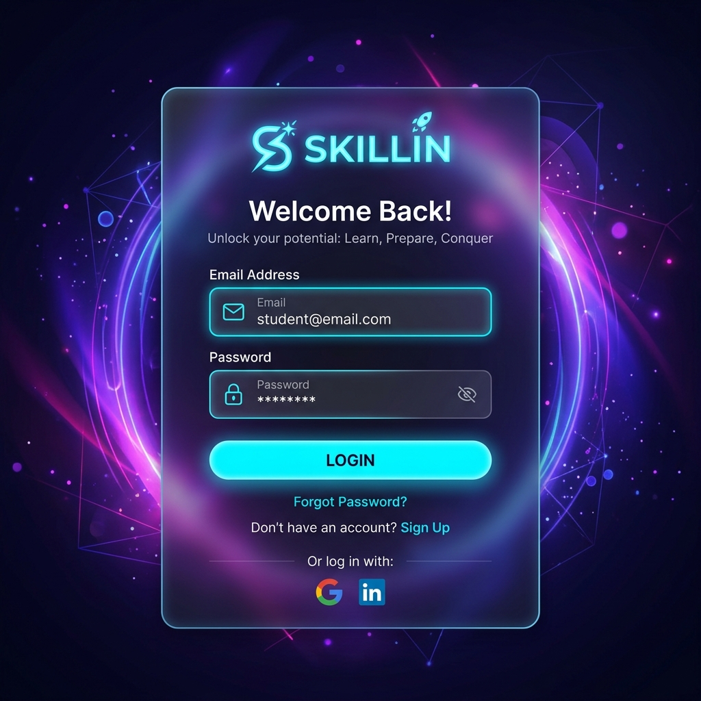
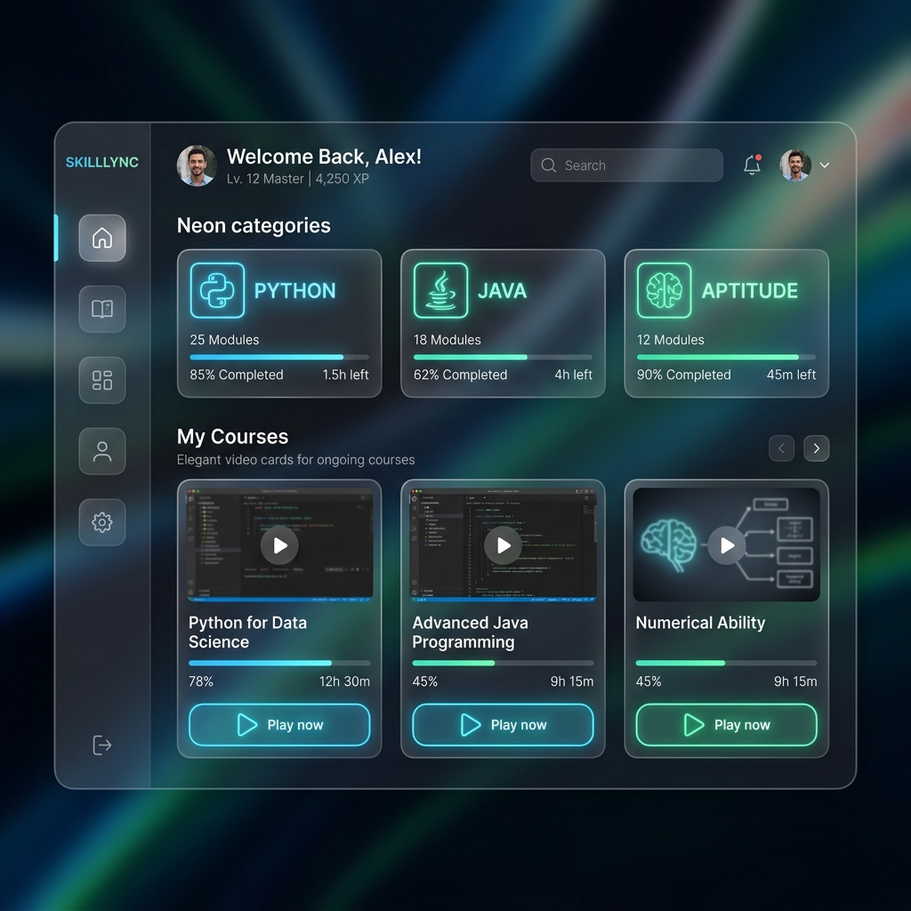
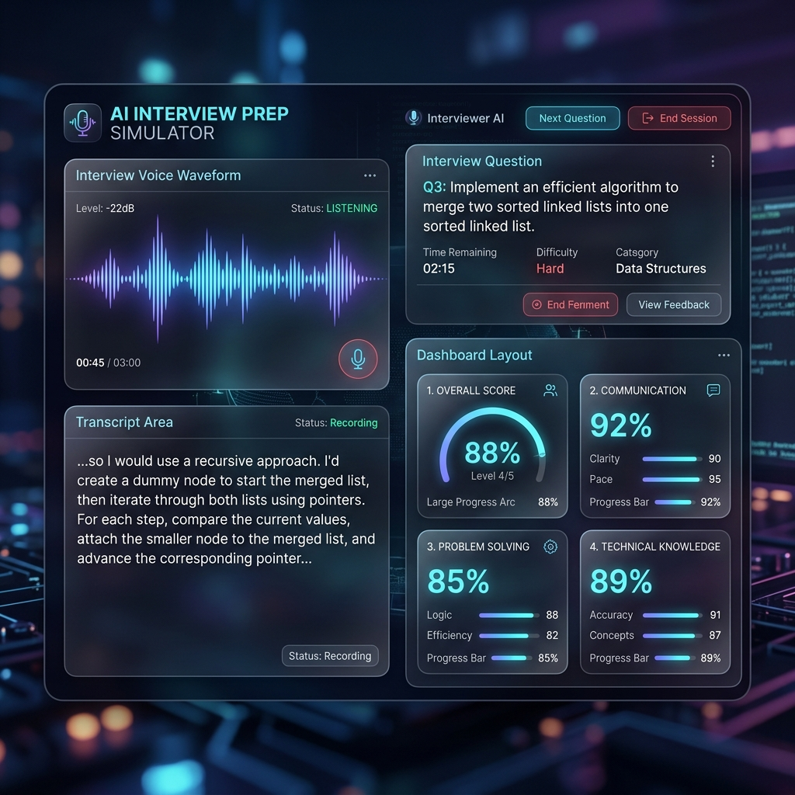

# 🚀 Skillin: Premium AI-Powered Student Prep & Learning Platform

**Skillin** is a full-stack, voice-enabled, and AI-powered learning platform designed to help students master coding skills, practice real-time technical interviews, track learning milestones, and explore dynamic career opportunities. Styled with a premium dark-mode glassmorphism interface.

---

## 📸 Platform Interface Screenshots

### 1. Welcome & Login Screen


### 2. Student Learning Dashboard


### 3. Voice-Enabled AI Mentor (Technical Interview Room)


---

## ✨ Core Features & Workflows

### 💻 1. Dynamic Course & Video Hub
* **Multi-Language Support**: Explore training videos across 10 skill fields: Python, Java, Aptitude, Web Development, Frontend, Backend, Cloud Computing, Cyber Security, Data Analytics, and Data Science.
* **Real-time YouTube Streaming**: Uses the **YouTube Data API v3** to search and display relevant educational videos in real time.
* **Offline Fallback Playlist**: If you hit YouTube API quota limits or lose connection, the platform automatically switches to a curated database of premium tutorials.

### 🤖 2. Interactive Voice-Enabled AI Mentor
* **Real-time Voice Simulation**: Uses the browser's native **Web Speech API** (Speech Recognition & Synthesis) to ask questions verbally and convert your spoken answers into text.
* **Dual LLM & Rule-Based Evaluation**:
  * **Online Mode**: Interacts with local **Ollama** LLM instances to create questions and score answers dynamically.
  * **Offline Mode (Fail-Safe)**: If Ollama is offline or takes too long (> 2s), the system instantly falls back to a curated library of **150+ interview questions** and evaluates your answers using an advanced keyword rubric tracking:
    * *Concept Accuracy*
    * *Clarity and Coherence*
    * *Technical Depth*
    * *Practical Coding Examples*

### 🎯 3. Skill Missions
* Set goals and complete missions (e.g. *Build REST API with FastAPI*) to increase your platform progress.
* Completing missions earns you score points, building your global **Skillin Score** displayed in your header.

### 💼 4. Opportunities Board
* Scrapes and compiles active placement postings, hackathons, and internship lists from major platforms (LinkedIn, Internshala, Unstop) in real time.

### 👤 5. Student Profile & CV uploads
* Manage user bios, track your level across skills, and upload avatars and PDF resumes.

---

## 🛠️ Tech Stack

* **Frontend**: Vanilla HTML5, JavaScript (ES6+), Glassmorphism CSS, and FontAwesome Icons.
* **Backend**: FastAPI (Python), Uvicorn.
* **Database**: SQLite (SQLAlchemy ORM).
* **Migrations**: Alembic.
* **AI Engine**: Ollama (Local LLM Integration) & Custom Keyword-matching Rubric.
* **APIs & Scrapers**: YouTube Data API v3, BeautifulSoup4, and Feedparser.

---

## 🚀 Installation & Local Setup

### 1. Backend Server Setup
Navigate to the `backend/` directory:
```bash
cd backend
```

Create a virtual environment and install packages:
```bash
python -m venv venv
venv\Scripts\activate   # Windows
source venv/bin/activate  # macOS/Linux

pip install -r requirements.txt
```

Set up your `.env` configuration file inside `backend/` (refer to `.env.example` if available):
```env
YOUTUBE_API_KEY=your_youtube_api_key_here
JWT_SECRET=your_jwt_secret_here
OLLAMA_URL=http://127.0.0.1:11434/api/generate
```

Run Alembic database migrations:
```bash
alembic upgrade head
```

Launch the FastAPI backend server:
```bash
uvicorn main:app --reload
```
The backend API is now running at `http://127.0.0.1:8000`.

### 2. Frontend Launch
Run a local static file server from the root directory or `frontend/` folder:
```bash
# From root directory
python -m http.server 8080
```
Open your browser and navigate to `http://localhost:8080/index.html`.

---

## 🧪 Running Integration Tests
To verify all core API endpoints, database functions, and real-time YouTube queries, run the following test commands:
```bash
# Verify real-time YouTube Data API fetching
python backend/test_youtube_realtime.py

# Run full-stack API integration test (Login -> Missions -> Interview lifecycle)
python backend/test_all_apis.py
```
